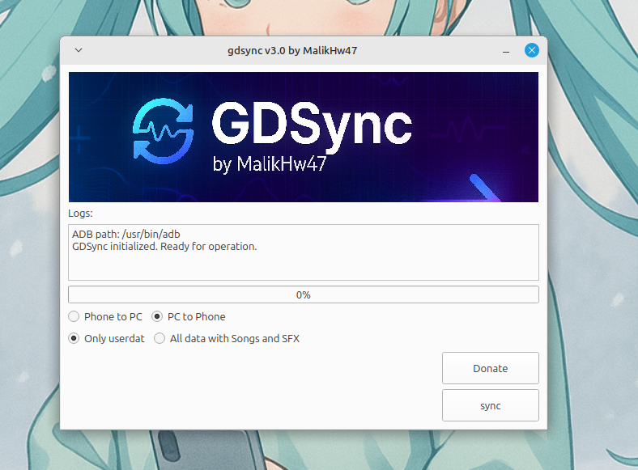

# GD Sync - Geometry Dash Data Sync Tool

GD Sync is a tool designed to sync your Geometry Dash data (levels, progress, etc.) between your Android device and your PC. With GD Sync, you can easily transfer your Geometry Dash data back and forth, ensuring that your progress is always up-to-date on both platforms.


## Dependcies
### Debian/Ubuntu

```bash
sudo apt install adb
```
### Arch:

```bash
sudo pacman -S android-tools
```

### Windows:

**Python isnt required at all since its bundled inside the app itself**

[ADB TOOLS](https://dl.google.com/android/repository/platform-tools-latest-windows.zip)
(pls install from here)
then extract
then follow [THIS SHIT VIDEO](https://www.youtube.com/watch?v=bIWe8RYs-dI)

## Screenshots

### UI:


## [Video](https://youtube.com/shorts/yiu1b-tfhow?si=ZwgrMbMPuXbXVQtV)


## Features

- Only when the phone has Geode this works
- Sync Geometry Dash user data (levels and progress) between your Android device and Linux PC.
- Supports both pushing (PC → Phone) and pulling (Phone → PC) data.
- Easy-to-use interface (GUI).

## Building!

clone the repo and
```
cd windows # whether on Linux or Windows
pyinstaller gdsync.spec # will build for windows if ur on windows, will build on linux if ur on linux
```

## Installation

### For Linux via binary file

just go to the *releases* page and get the `gdsync-linux` file, and `chmod +x gdsync-linux`, to run, `./gdsync-linux` or double click

### IF YOU ARE AN ARCH BTW USER!:

its easier for you, just make sure you have an AUR helper like `yay`, then
```bash
yay -S gdsync-bin
```
and to execute:
```bash
gdsync-linux
```
or run the shortcut in your Applications

### For Windows (WILL TEST LATER)

just download the **.exe** file from the releases tab

**Android Device**:

You need an Android device with USB Debugging enabled. To enable USB Debugging:
- Go to *Settings* → *About Phone* → Tap on *Build Number* multiple times to unlock *Developer Options.*
- Go to *Developer Options* → *Enable USB Debugging.*

### if you liked my project, can you leave me a small donation? [ko-fi](https://www.ko-fi.com/MalikHw47)

## To-Do:

- Sync to the phone to Geometry Dash directly (no Geode)(only with a Rooted Phone)

## Bugs or fixes

- feel free to open an issue

