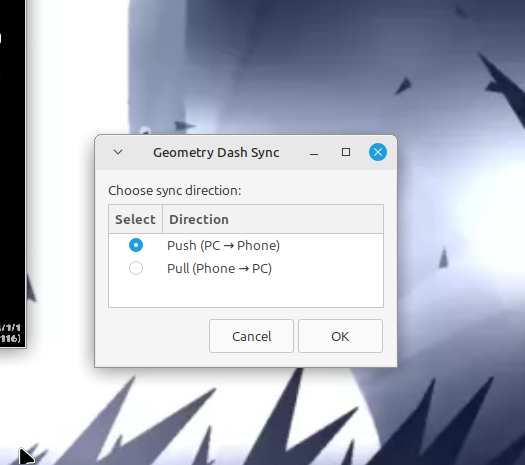
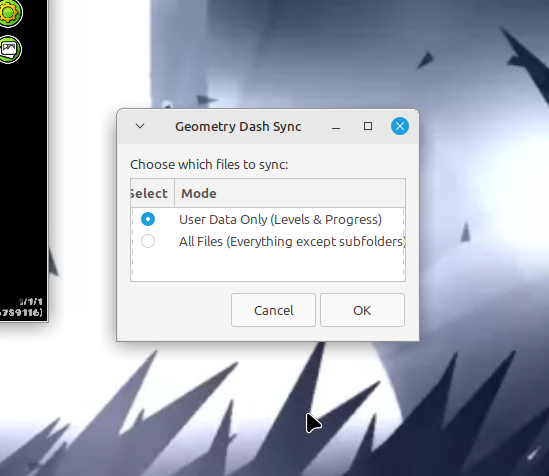
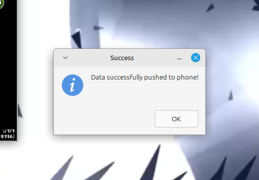

# GD Sync - Geometry Dash Data Sync Tool

GD Sync is a tool designed to sync your Geometry Dash data (levels, progress, etc.) between your Android device and your PC (Linux). With GD Sync, you can easily transfer your Geometry Dash data back and forth, ensuring that your progress is always up-to-date on both platforms.

## Dependcies:
```
sudo apt update
sudo apt install adb zenity -y
```

## Screenshots

### Choosing the Target:


### Choosing what to transfer:


### Success Screenshot:



## Features

- Only when the phone has Geode this works
- Sync Geometry Dash user data (levels and progress) between your Android device and Linux PC.
- Supports both pushing (PC → Phone) and pulling (Phone → PC) data.
- Easy-to-use interface (GUI).

## Building!

just clone this repo and do a simple

```
chmod +x build.sh
./build.sh
```

## Installation

### For Linux via deb file

just go to the *releases* page and get the **.deb** file lol


**Android Device**: You need an Android device with USB Debugging enabled. To enable USB Debugging:

Go to *Settings* → *About Phone* → Tap on *Build Number* multiple times to unlock *Developer Options.*

Go to *Developer Options* → *Enable USB Debugging.*

# WIndows Version, WIP

-if you liked my project, can you leave me a small donation? [ko-fi](https://www.ko-fi.com/MalikHw47)
